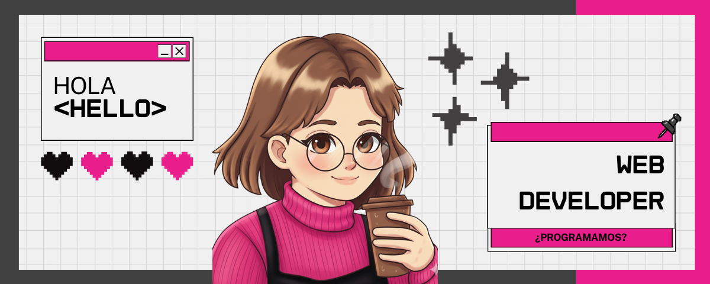

  

# 👋 ¡Hola! Soy NellysMata 🌺

🎯 **Desarrolladora Web | Apasionada por el diseño UX/UI y el código limpio**

Actualmente estudio **Desarrollo de Aplicaciones Web (DAW)** y he completado un **bootcamp de desarrollo web fullstack**, donde aprendí a crear proyectos funcionales con **HTML, CSS, JavaScript, PHP y MySQL**.  
Además, estoy realizando un **curso oficial de creación de páginas web**, en el que estoy aprendiendo a manejar **WordPress con PHP, JavaScript avanzado, diseño UX/UI, manejo de bases de datos**.

---

### 🚀 Tecnologías y herramientas

💻 **Frontend:** HTML · CSS · JavaScript · UX/UI · Responsive Design  
⚙️ **Backend:** PHP · Java · MySQL  
🔧 **Herramientas:** Git · GitHub · XAMPP · Odoo · XML · JSON · Canva
📚 **Aprendiendo actualmente:** Java y redes informáticas 🥵

---

### 🧠 Lo que me motiva

Me gusta crear experiencias digitales **minimalistas, intuitivas y funcionales**, que conecten con las personas.  
Busco crecer como **desarrolladora fullstack**, combinando **diseño y tecnología 🤩**.

---

### 🧩 Proyectos destacados

| 🌟 Proyecto | 💬 Descripción | 🛠️ Tecnologías |
|-------------|----------------|----------------|
| [Portfolio personal](https://tusitio.com) | Mi espacio digital para mostrar mis proyectos y estilo. | HTML, CSS, JS |
| [Gestor de tareas](#) | App simple para organizar tareas diarias. | PHP, MySQL, JS |
| [Landing UX/UI](#) | Diseño responsive minimalista inspirado en *cassie.codes*. | HTML, CSS, Figma |

---

### 📫 Conecta conmigo

🌐 [Portfolio](https://tusitio.com)  

💼 [LinkedIn](www.linkedin.com/in/nellysmata)  

📧 [Email](mailto:nellysmata.dev@gmail.com)    

🐙 [GitHub](https://github.com/NellysMata)

---

> 🌸 *“Si no lo hago, ¿cuándo?”* – Nellys
